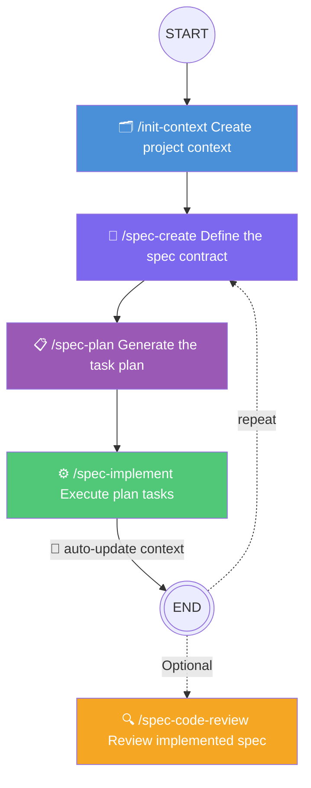
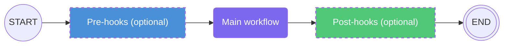

# BareSpec

A minimal spec-driven development framework for AI coding agents.

> Compliant with the [Agent Plugins 1.0.0](https://agent-plugins.org/) specification.

---

- [BareSpec](#barespec)
  - [Quick Start](#quick-start)
  - [Skills](#skills)
    - [`/init-context` — Project Context](#init-context--project-context)
    - [`/spec-create` — Feature Spec](#spec-create--feature-spec)
    - [`/spec-plan` — Implementation Plan](#spec-plan--implementation-plan)
    - [`/spec-implement` — Implement](#spec-implement--implement)
    - [`/spec-code-review` — Two-Axis Code Review](#spec-code-review--two-axis-code-review)
  - [Standard Workflow](#standard-workflow)
  - [`/init-config` — Customize Workflow with Custom Pre/Post Hooks](#init-config--customize-workflow-with-custom-prepost-hooks)
  - [`barespec-guide` — Autonomous Framework Knowledge Base](#barespec-guide--autonomous-framework-knowledge-base)
  - [Output File Structure](#output-file-structure)

---

## Quick Start

Run the skills as slash commands in any compatible AI coding agent:

```
/init-context           # 1. Set up project context
/spec-create <feature>  # 2. Write a feature spec (spec.yaml)
/spec-plan <spec>       # 3. Generate the implementation plan (plan.md)
/spec-implement <spec>  # 4. Execute the plan
```

## Skills

### `/init-context` — Project Context

Creates or updates `barespec/context.md`, the single source of truth that all other skills read for background on the project.

**What it captures:**
- Product description and purpose
- Architecture style and components
- Tech stack (languages, frameworks, databases, tooling)
- Non-functional requirements

**When to use:**
- First time setting up BareSpec on a project
- After completing a feature that changes the architecture or stack
- When onboarding AI agents to a codebase

The skill inspects the codebase automatically, then interviews you in rounds to close the remaining gaps.

---

### `/spec-create` — Feature Spec

Creates or updates a feature spec inside `barespec/specs/<spec-name>/`. This skill writes **only** `spec.yaml` (the requirement contract); the implementation plan is generated separately by `/spec-plan`.

**What it captures:**
- `feature` metadata (name, version, description)
- Functional requirements, grouped into `components` (UPPER_SNAKE keys)
- Cross-cutting `constraints` (security, performance, privacy, ...)
- Dependencies inferred from existing specs and context

**What it produces:**
- `spec.yaml` — filled from `spec.template.yaml`; never modified during implementation. Tracking lives in the `feature` block (`status: draft`).

**When to use:**
- Defining a new feature or requirement
- Refining or updating an existing spec

If a spec already exists, the skill asks whether to update it or create a new spec with a different name. Updating refreshes `feature.updated` and resets the spec to `draft` so the plan can be regenerated. After writing the spec, the skill points you to `/spec-plan` to generate the tasks.

**Requirement IDs (ACIDs):**
- Each requirement is numbered within its group and referenced by its **ACID**: `<feature-name>.<GROUP_KEY>.<ID>` (e.g. `user-auth.LOGIN.1-1`)
- The implementation plan tags each task with the ACID(s) it satisfies

**Dependency handling:**
- `requires:` lives in the `feature` block and lists spec names that must reach `done` first
- Dependencies are inferred automatically from the existing specs and the new requirement
- The user is asked only when the dependency relationship is ambiguous
- A spec with unmet dependencies cannot be implemented until all entries in `requires:` are `done`

---

### `/spec-plan` — Implementation Plan

Reads an existing `spec.yaml` and breaks it into an ordered, testable task checklist written to `plan.md` inside the same `barespec/specs/<spec-name>/` folder. It is the bridge between the spec (what to build) and `/spec-implement` (which executes the tasks).

**What it produces:**
- `plan.md` — filled from `plan.template.md`; approach, trade-offs, ordered task checklist with ACID tags and **Done when:** checks

**What it does:**
1. Reads `context.md` and the selected `spec.yaml`
2. Breaks the spec requirements into ordered, vertically-sliced tasks following the task rules
3. Presents the breakdown for confirmation before writing `plan.md`
4. Advances the spec from `status: draft` to `status: ready`

**When to use:**
- Right after writing or updating a spec
- To regenerate or extend a plan when the spec changed

If a `plan.md` already exists, the skill asks whether to **regenerate** it (replace) or **append** new tasks (preserve history). It never modifies the requirements in `spec.yaml` — only its `feature.status` and `feature.updated` fields.

**Status lifecycle:**

| Status | Set by | Meaning |
|--------|--------|---------|
| `draft` | `spec-create` | Spec contract written, no plan yet |
| `ready` | `spec-plan` | Plan generated, ready to implement |
| `in-progress` | `spec-implement` | Implementation started |
| `done` | `spec-implement` | Implementation completed |

---

### `/spec-implement` — Implement

Executes the task list in `plan.md` for a given spec.

**What it does:**
1. Reads and executes tasks from `plan.md` one by one
2. Tracks progress and updates spec status (`in-progress` → `done`)
3. Checks off requirements as implementation completes
4. Re-evaluates dependent specs and reports which ones are now implementable
5. Auto-updates `context.md` to reflect architecture or stack changes

**Task lifecycle:**
- On first run (`ready`): reads tasks from `plan.md`, starts implementing
- On resume (`in-progress`): finds first unchecked task across all `## Tasks` sections, continues
- If the spec is still `draft` (no plan): blocks and asks you to run `/spec-plan` first
- If the spec has unmet `requires`: stops and lists the unmet dependencies
- If `plan.md` has no tasks: blocks and asks you to run `/spec-plan` first

**Input:** Spec name (e.g., `/spec-implement user-auth`). If omitted, lists available specs with `ready` or `in-progress` status. Ready specs whose dependencies are not yet complete are shown as not implementable yet.

---

### `/spec-code-review` — Two-Axis Code Review

Reviews the diff between `HEAD` and a fixed point (commit, branch, tag, or merge-base) — or, when no fixed point is given, your uncommitted local changes — along two independent axes, each run by a parallel sub-agent so neither pollutes the other's context. **Report-only — it never applies fixes, edits source files, checks off plan tasks, or changes `feature.status`.**

- **Coding Standards** — does the diff follow the conventions in `context.md`, any repo standards docs (`AGENTS.md`, `CONTRIBUTING.md`, ...), and a built-in Fowler code-smell baseline?
- **Spec** — does the diff implement what the spec asked for? Resolved, in order: a spec name passed as an argument, a spec folder matching the branch/commit messages, a recently-updated `in-progress`/`done` spec, or asking the user. As a last resort, with no spec file, it falls back to a one-line intent description supplied at invocation; with neither, the Spec axis is skipped.

**What it produces:** a side-by-side report — `## Coding Standards` and `## Spec` findings, never merged or reranked — plus a one-line summary and pointers to the next command (`/spec-implement`, `/spec-create`, `/spec-plan`).

**When to use:**
- Reviewing a branch or PR before merging
- Checking work-in-progress changes against the spec that produced them
- Auditing an implemented spec for scope creep or missed requirements

**Input:** `/spec-code-review [fixed-point] [spec-name-or-description]`. All arguments are optional.

**Example invocations:**
```
/spec-code-review
# No arguments — reviews uncommitted local changes (working tree + staged)
# against HEAD. Spec is auto-resolved from the current branch name.

/spec-code-review main
# Reviews committed changes on the current branch since it diverged from
# main. Spec is auto-resolved from the branch name or commit messages.

/spec-code-review main user-authentication
# Same diff, but reviews against a specific spec instead of relying on
# auto-resolution.

/spec-code-review main "adds rate limiting to the login endpoint"
# No spec.yaml exists yet — reviews the diff against a one-line
# description of intent instead.

/spec-code-review v1.2.0
# Reviews everything shipped since tag v1.2.0. Spec is still auto-resolved
# (branch name, commit messages, or a recently-updated spec) — asked only
# if nothing matches.
```

If the working tree is clean and no fixed point is given, the skill asks for one — there is nothing local to review.

---

## Standard Workflow



1. **Initialize context** — Run `/init-context` to capture the project's foundation.
2. **Spec a feature** — Run `/spec-create <feature>` to define the requirement contract (`spec.yaml`, status `draft`).
3. **Plan the work** — Run `/spec-plan <spec-name>` to generate `plan.md` with ordered tasks (status `ready`).
4. **Implement** — Run `/spec-implement <spec-name>` to execute the tasks in `plan.md`.
5. **Context auto-updated** — On completion, `context.md` is updated and development notes are written into `spec.yaml`.
6. **Repeat** for the next feature.

## `/init-config` — Customize Workflow with Custom Pre/Post Hooks

Scaffolds or updates `./barespec/barespec.config.yml` — the YAML file that defines custom pre/post hook instructions for each BareSpec step.

**What hooks do:**
- **pre hooks** run before a skill's main workflow (e.g., check git status, verify prerequisites)
- **post hooks** run after a skill completes (e.g., update CHANGELOG, run linting)
- Hooks are plain-text instructions executed by the AI model — no scripts or shell commands

**Supported events:**

| Step | Pre hook | Post hook |
|------|----------|-----------|
| `context` | `hooks.context.pre` | `hooks.context.post` |
| `spec` | `hooks.spec.pre` | `hooks.spec.post` |
| `plan` | `hooks.plan.pre` | `hooks.plan.post` |
| `implement` | `hooks.implement.pre` | `hooks.implement.post` |

**When to use:**
- First time setting up hooks on a project
- Adding or editing existing hook instructions
- Resetting the config to the default template

The config file is **optional** — if it doesn't exist, all four skills run without hooks.

> **Tip:** Run `/init-config` at any time to create or update `barespec.config.yml`. The skill walks you through all eight hook events one by one, shows the current value for each (if the file already exists), and rewrites the file with your updated instructions. You can re-run it whenever you want to add, change, or remove hooks.

**Example `barespec.config.yml`:**
```yaml
hooks:
  spec:
    pre:
      - "Check that the git working directory is clean before creating the spec."
  implement:
    pre:
      - "Run the existing test suite and confirm it is green before starting."
    post:
      - "Run 'npm run lint && npm test' and fix any failures before closing the spec."
      - "Extract key lessons learned from the implementation work and update context.md to reflect any new insights about the architecture, patterns, or constraints discovered during implementation."
```



---

## `barespec-guide` — Autonomous Framework Knowledge Base

A background knowledge skill that is **not a slash command**. It is automatically loaded by any agent whenever the conversation mentions a BareSpec topic — skill names, file names, framework concepts, or spec-related terms.

**It does not create or modify any files and requires no user invocation.**

**What it provides:**
- Full framework overview and workflow lifecycle
- Per-skill behavioral reference (`init-context`, `spec-create`, `spec-plan`, `spec-implement`, `init-config`)
- File structure reference (`barespec/` root folder, `specs/` subfolder)
- Spec lifecycle, status values, dependency rules, and task format
- Hook system reference and config format
- Logic for assessing current project state and determining the next recommended action

**Trigger topics** (automatic activation):
`BareSpec`, `init-context`, `spec-create`, `spec-plan`, `spec-implement`, `init-config`, `context.md`, `spec.yaml`, `plan.md`, hooks config, spec-driven development

---

## Output File Structure 

```
your-project/
└── barespec/
    ├── context.md
    ├── barespec.config.yml     # Hook configuration (optional)
    └── specs/
        ├── user-authentication/
        │   ├── spec.yaml     # Requirement contract (created by spec-create, never modified during implementation)
        │   └── plan.md     # Task checklist + dev notes after completion
        └── csv-export/
            ├── spec.yaml     # Requirement contract (created by spec-create, never modified during implementation)
            └── plan.md     # Task checklist + dev notes after completion
```

